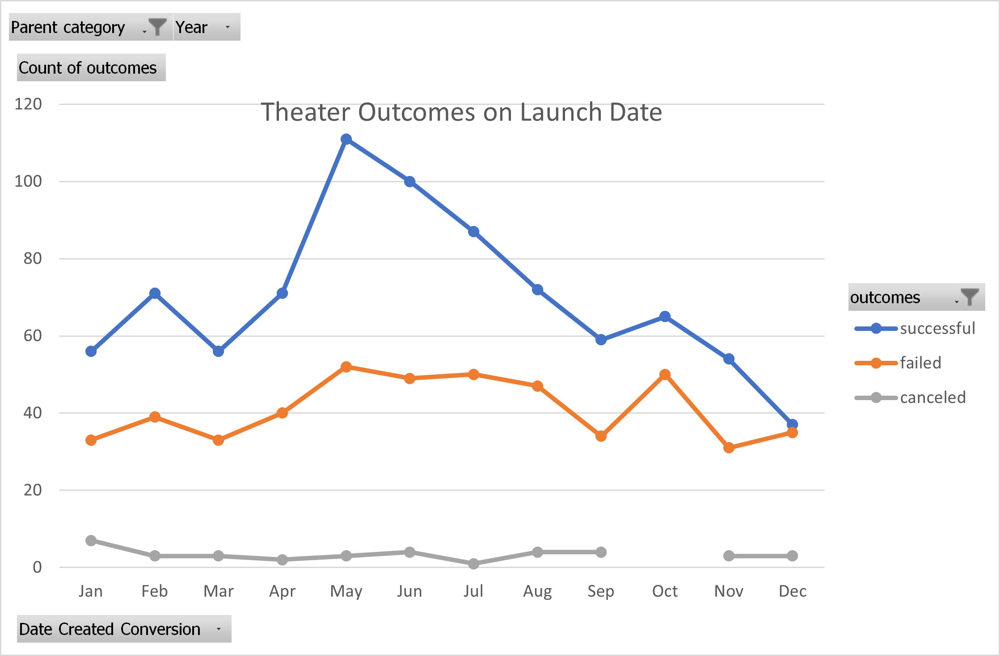
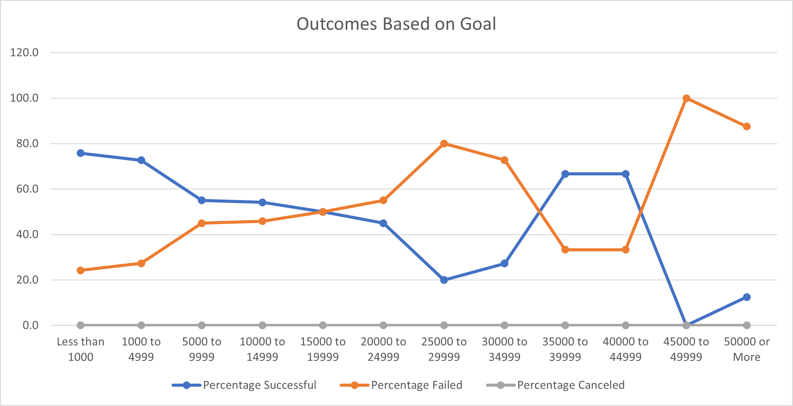

# Kickstarting with Excel

## Overview of Project
The purpose of this study is to go over the past crowdfunded kickstarter campaign data to help Louise to optimize his play campaign called Fever. Louis have the kickstarter data that has the information for successful, failed, live and canceled project. It also provide their goal and acquired fund in the campaign. The data was gathered in different countries and for different campains which includes Music, Theater, Documentary and more.  
### Purpose
Our purpose in this study is to comb the data to find the relevant information that might help Louis to fund his play. The information that Louise specificly is looking for is the best month to start the campaign and the amount of fund that she can acquire for her campaign.   
## Analysis and Challenges
In this analysis, we have used Microsoft Excel software as our dataset is not very large. In this software we have used pivot table and chart to filter and gather relevant information. In addition we have used some of the built-in function that Excel provides, such as Year(), COUNTIFS, VLOOKUP and more.
There was not a major challenge in this work. The only minor challenge that I faced was using COUNTIF instead of COUNTIFS command. Another possible challenge that other user might face was using and understanding how pivot tables work. It is a very overwhelming information even for users that have already worked with Excel, But at the same time, it is a great tool to summarize all the information.

### Analysis of Outcomes Based on Launch Date
To analyze the data based on the lunch date, first the date column is converted from Unix Timestamps into month/day/year format. We used Pivot table to analyze the data based on the lunch date and count of the outcome (success, fail, cancel and live). One of the great feature of the pivot table and dates in the Microsoft Excel is filtering the dates based on month, quarters and years. This feature is used to find the best month to start the campaign.
Looking at the figure and the information that was extracted from the launch date of the fundraising campaign, it is easy to understand that there is a higher success rate for the campaigns that have started in the months of May and June. The worst month to start a campaign is December and January. Looking at the failed and canceled kickstarters graph we can see that they are nearly independent of the month that they are started.

### Analysis of Outcomes Based on Goals
To analyze the data based on the goal amount, the data is combed through using Countifs command. First, the amount of goal that each project has is categorized. Next, using Countifs command, the projects that are succeeded, failed and canceled are counted if they are in the play subcatagory.  
Taking a look at the graph shows that putting a lower goal for the campaign increases the success rate of the campaign. Campaigns that have a higher goals have a higher failure rate. There is an exception in the graph from 35000 to 45000. One of the reasons behind this exception is that the number of campaigns that are analyzed in this section is very low (9 projects) and this does effects the results.

### Challenges and Difficulties Encountered

## Results

- What are two conclusions you can draw about the Outcomes based on Launch Date?
As mentioned above there is a higher success rate for the campaigns that have started in the months of May and June. The worst month to start a campaign is December. Looking at the failed and canceled kickstarters graph we can see that they are nearly independent of the month that they are started.

- What can you conclude about the Outcomes based on Goals?
Putting a lower goal for the campaign increases the success rate of the campaign. Campaigns that have a higher goals have a higher failure rate.

- What are some limitations of this dataset?
One of the limitation that we saw in the data was campaings with higher goal amounts Which caused our analysis to be less accurate when calculating the success rate of projects. Another limitiation was having many outlaiers in our data. 

- What are some other possible tables and/or graphs that we could create?
One useful table and graph that can help Louis is the amount of pledge and number of backers for a successful plays. This way we can find a more reasonable goal for her kickstarter program and estimate the number of backers she will need.
